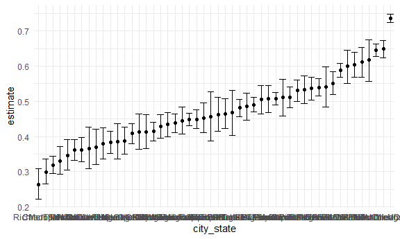
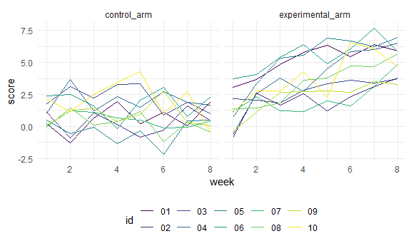

p8105\_hw5\_yz4184
================
Yunlin Zhou
11/20/2021

    ## -- Attaching packages --------------------------------------- tidyverse 1.3.1 --

    ## v ggplot2 3.3.5     v purrr   0.3.4
    ## v tibble  3.1.4     v dplyr   1.0.7
    ## v tidyr   1.1.3     v stringr 1.4.0
    ## v readr   2.0.1     v forcats 0.5.1

    ## -- Conflicts ------------------------------------------ tidyverse_conflicts() --
    ## x dplyr::filter() masks stats::filter()
    ## x dplyr::lag()    masks stats::lag()

    ## 
    ## Attaching package: 'rvest'

    ## The following object is masked from 'package:readr':
    ## 
    ##     guess_encoding

### Problem 1

``` r
homicide_df = 
  read_csv("./homicide-data.csv", na = c("","Unknown"))%>%
  mutate(
    city_state = str_c(city, state),
    resolution = case_when(
      disposition == "Closed without arrest" ~ "unsolved",
      disposition == "Open/No arrest" ~ "unsolved",
      disposition == "Closed by arrest" ~ "solved",
    )
  )%>%
  relocate(city_state)%>%
  filter(city_state != "TulsaAL")
```

    ## Rows: 52179 Columns: 12

    ## -- Column specification --------------------------------------------------------
    ## Delimiter: ","
    ## chr (8): uid, victim_last, victim_first, victim_race, victim_sex, city, stat...
    ## dbl (4): reported_date, victim_age, lat, lon

    ## 
    ## i Use `spec()` to retrieve the full column specification for this data.
    ## i Specify the column types or set `show_col_types = FALSE` to quiet this message.

``` r
baltimore_df = 
  homicide_df%>%
  filter(city_state == "BaltimoreMD")

baltimore_summary = 
  baltimore_df%>%
  summarize(
    unsolved = sum(resolution == "unsolved"),
    n = n()
  )

baltimore_test =   
prop.test(
  x = baltimore_summary%>%pull(unsolved),
  n = baltimore_summary%>%pull(n))

baltimore_test%>%
  broom::tidy()
```

    ## # A tibble: 1 x 8
    ##   estimate statistic  p.value parameter conf.low conf.high method    alternative
    ##      <dbl>     <dbl>    <dbl>     <int>    <dbl>     <dbl> <chr>     <chr>      
    ## 1    0.646      239. 6.46e-54         1    0.628     0.663 1-sample~ two.sided

``` r
prop_test_function = function(city_df){
  
  city_summary = 
  city_df%>%
  summarize(
    unsolved = sum(resolution == "unsolved"),
    n = n()
  )
  
  
city_test =   
prop.test(
  x = city_summary%>%pull(unsolved),
  n = city_summary%>%pull(n))
  
return(city_test)
}

prop_test_function(baltimore_df)
```

    ## 
    ##  1-sample proportions test with continuity correction
    ## 
    ## data:  city_summary %>% pull(unsolved) out of city_summary %>% pull(n), null probability 0.5
    ## X-squared = 239.01, df = 1, p-value < 2.2e-16
    ## alternative hypothesis: true p is not equal to 0.5
    ## 95 percent confidence interval:
    ##  0.6275625 0.6631599
    ## sample estimates:
    ##         p 
    ## 0.6455607

``` r
homicide_df %>%
  filter(city_state == "AlbuquerqueNM")%>%
  prop_test_function()
```

    ## 
    ##  1-sample proportions test with continuity correction
    ## 
    ## data:  city_summary %>% pull(unsolved) out of city_summary %>% pull(n), null probability 0.5
    ## X-squared = 19.114, df = 1, p-value = 1.232e-05
    ## alternative hypothesis: true p is not equal to 0.5
    ## 95 percent confidence interval:
    ##  0.3372604 0.4375766
    ## sample estimates:
    ##         p 
    ## 0.3862434

``` r
results_df = 
homicide_df%>%
  nest(data = uid:resolution)%>%
  mutate(
    test_results = map(data,prop_test_function),
    tidy_results = map(test_results, broom::tidy)
  )%>%
  select(city_state, tidy_results)%>%
  unnest(tidy_results)%>%
  select(city_state, estimate, starts_with("conf"))
```

``` r
results_df%>%
  mutate(
    city_state = fct_reorder(city_state, estimate))%>%
  ggplot(aes(x = city_state, y = estimate)) +
  geom_point()+
  geom_errorbar(aes(ymin = conf.low, ymax = conf.high))
```



``` r
theme(axis.text.x = element_text(angle = 90, vjust = 0.5, hjust = 1))
```

    ## List of 1
    ##  $ axis.text.x:List of 11
    ##   ..$ family       : NULL
    ##   ..$ face         : NULL
    ##   ..$ colour       : NULL
    ##   ..$ size         : NULL
    ##   ..$ hjust        : num 1
    ##   ..$ vjust        : num 0.5
    ##   ..$ angle        : num 90
    ##   ..$ lineheight   : NULL
    ##   ..$ margin       : NULL
    ##   ..$ debug        : NULL
    ##   ..$ inherit.blank: logi FALSE
    ##   ..- attr(*, "class")= chr [1:2] "element_text" "element"
    ##  - attr(*, "class")= chr [1:2] "theme" "gg"
    ##  - attr(*, "complete")= logi FALSE
    ##  - attr(*, "validate")= logi TRUE

``` r
homicide_df%>%
group_by(city_state)%>%
  summarize(
    unsolved = sum(resolution == "unsolved"),
    n = n()
  )%>%
  mutate(
    test_results = map2(unsolved,n,prop.test),
    tidy_results = map(test_results, broom::tidy)
  )%>%
  select(city_state, tidy_results)%>%
  unnest(tidy_results)%>%
  select(city_state, estimate, starts_with("conf"))
```

    ## # A tibble: 50 x 4
    ##    city_state    estimate conf.low conf.high
    ##    <chr>            <dbl>    <dbl>     <dbl>
    ##  1 AlbuquerqueNM    0.386    0.337     0.438
    ##  2 AtlantaGA        0.383    0.353     0.415
    ##  3 BaltimoreMD      0.646    0.628     0.663
    ##  4 Baton RougeLA    0.462    0.414     0.511
    ##  5 BirminghamAL     0.434    0.399     0.469
    ##  6 BostonMA         0.505    0.465     0.545
    ##  7 BuffaloNY        0.612    0.569     0.654
    ##  8 CharlotteNC      0.300    0.266     0.336
    ##  9 ChicagoIL        0.736    0.724     0.747
    ## 10 CincinnatiOH     0.445    0.408     0.483
    ## # ... with 40 more rows

### Problem 2

``` r
file_names = list.files(path = "./data")
```

``` r
import_data = function(x){
  x = read_csv(x)
  return(x)
}

output =  map(file_names, import_data)
```

    ## Rows: 1 Columns: 8

    ## -- Column specification --------------------------------------------------------
    ## Delimiter: ","
    ## dbl (8): week_1, week_2, week_3, week_4, week_5, week_6, week_7, week_8

    ## 
    ## i Use `spec()` to retrieve the full column specification for this data.
    ## i Specify the column types or set `show_col_types = FALSE` to quiet this message.

    ## Rows: 1 Columns: 8

    ## -- Column specification --------------------------------------------------------
    ## Delimiter: ","
    ## dbl (8): week_1, week_2, week_3, week_4, week_5, week_6, week_7, week_8

    ## 
    ## i Use `spec()` to retrieve the full column specification for this data.
    ## i Specify the column types or set `show_col_types = FALSE` to quiet this message.

    ## Rows: 1 Columns: 8

    ## -- Column specification --------------------------------------------------------
    ## Delimiter: ","
    ## dbl (8): week_1, week_2, week_3, week_4, week_5, week_6, week_7, week_8

    ## 
    ## i Use `spec()` to retrieve the full column specification for this data.
    ## i Specify the column types or set `show_col_types = FALSE` to quiet this message.

    ## Rows: 1 Columns: 8

    ## -- Column specification --------------------------------------------------------
    ## Delimiter: ","
    ## dbl (8): week_1, week_2, week_3, week_4, week_5, week_6, week_7, week_8

    ## 
    ## i Use `spec()` to retrieve the full column specification for this data.
    ## i Specify the column types or set `show_col_types = FALSE` to quiet this message.

    ## Rows: 1 Columns: 8

    ## -- Column specification --------------------------------------------------------
    ## Delimiter: ","
    ## dbl (8): week_1, week_2, week_3, week_4, week_5, week_6, week_7, week_8

    ## 
    ## i Use `spec()` to retrieve the full column specification for this data.
    ## i Specify the column types or set `show_col_types = FALSE` to quiet this message.

    ## Rows: 1 Columns: 8

    ## -- Column specification --------------------------------------------------------
    ## Delimiter: ","
    ## dbl (8): week_1, week_2, week_3, week_4, week_5, week_6, week_7, week_8

    ## 
    ## i Use `spec()` to retrieve the full column specification for this data.
    ## i Specify the column types or set `show_col_types = FALSE` to quiet this message.

    ## Rows: 1 Columns: 8

    ## -- Column specification --------------------------------------------------------
    ## Delimiter: ","
    ## dbl (8): week_1, week_2, week_3, week_4, week_5, week_6, week_7, week_8

    ## 
    ## i Use `spec()` to retrieve the full column specification for this data.
    ## i Specify the column types or set `show_col_types = FALSE` to quiet this message.

    ## Rows: 1 Columns: 8

    ## -- Column specification --------------------------------------------------------
    ## Delimiter: ","
    ## dbl (8): week_1, week_2, week_3, week_4, week_5, week_6, week_7, week_8

    ## 
    ## i Use `spec()` to retrieve the full column specification for this data.
    ## i Specify the column types or set `show_col_types = FALSE` to quiet this message.

    ## Rows: 1 Columns: 8

    ## -- Column specification --------------------------------------------------------
    ## Delimiter: ","
    ## dbl (8): week_1, week_2, week_3, week_4, week_5, week_6, week_7, week_8

    ## 
    ## i Use `spec()` to retrieve the full column specification for this data.
    ## i Specify the column types or set `show_col_types = FALSE` to quiet this message.

    ## Rows: 1 Columns: 8

    ## -- Column specification --------------------------------------------------------
    ## Delimiter: ","
    ## dbl (8): week_1, week_2, week_3, week_4, week_5, week_6, week_7, week_8

    ## 
    ## i Use `spec()` to retrieve the full column specification for this data.
    ## i Specify the column types or set `show_col_types = FALSE` to quiet this message.

    ## Rows: 1 Columns: 8

    ## -- Column specification --------------------------------------------------------
    ## Delimiter: ","
    ## dbl (8): week_1, week_2, week_3, week_4, week_5, week_6, week_7, week_8

    ## 
    ## i Use `spec()` to retrieve the full column specification for this data.
    ## i Specify the column types or set `show_col_types = FALSE` to quiet this message.

    ## Rows: 1 Columns: 8

    ## -- Column specification --------------------------------------------------------
    ## Delimiter: ","
    ## dbl (8): week_1, week_2, week_3, week_4, week_5, week_6, week_7, week_8

    ## 
    ## i Use `spec()` to retrieve the full column specification for this data.
    ## i Specify the column types or set `show_col_types = FALSE` to quiet this message.

    ## Rows: 1 Columns: 8

    ## -- Column specification --------------------------------------------------------
    ## Delimiter: ","
    ## dbl (8): week_1, week_2, week_3, week_4, week_5, week_6, week_7, week_8

    ## 
    ## i Use `spec()` to retrieve the full column specification for this data.
    ## i Specify the column types or set `show_col_types = FALSE` to quiet this message.

    ## Rows: 1 Columns: 8

    ## -- Column specification --------------------------------------------------------
    ## Delimiter: ","
    ## dbl (8): week_1, week_2, week_3, week_4, week_5, week_6, week_7, week_8

    ## 
    ## i Use `spec()` to retrieve the full column specification for this data.
    ## i Specify the column types or set `show_col_types = FALSE` to quiet this message.

    ## Rows: 1 Columns: 8

    ## -- Column specification --------------------------------------------------------
    ## Delimiter: ","
    ## dbl (8): week_1, week_2, week_3, week_4, week_5, week_6, week_7, week_8

    ## 
    ## i Use `spec()` to retrieve the full column specification for this data.
    ## i Specify the column types or set `show_col_types = FALSE` to quiet this message.

    ## Rows: 1 Columns: 8

    ## -- Column specification --------------------------------------------------------
    ## Delimiter: ","
    ## dbl (8): week_1, week_2, week_3, week_4, week_5, week_6, week_7, week_8

    ## 
    ## i Use `spec()` to retrieve the full column specification for this data.
    ## i Specify the column types or set `show_col_types = FALSE` to quiet this message.

    ## Rows: 1 Columns: 8

    ## -- Column specification --------------------------------------------------------
    ## Delimiter: ","
    ## dbl (8): week_1, week_2, week_3, week_4, week_5, week_6, week_7, week_8

    ## 
    ## i Use `spec()` to retrieve the full column specification for this data.
    ## i Specify the column types or set `show_col_types = FALSE` to quiet this message.

    ## Rows: 1 Columns: 8

    ## -- Column specification --------------------------------------------------------
    ## Delimiter: ","
    ## dbl (8): week_1, week_2, week_3, week_4, week_5, week_6, week_7, week_8

    ## 
    ## i Use `spec()` to retrieve the full column specification for this data.
    ## i Specify the column types or set `show_col_types = FALSE` to quiet this message.

    ## Rows: 1 Columns: 8

    ## -- Column specification --------------------------------------------------------
    ## Delimiter: ","
    ## dbl (8): week_1, week_2, week_3, week_4, week_5, week_6, week_7, week_8

    ## 
    ## i Use `spec()` to retrieve the full column specification for this data.
    ## i Specify the column types or set `show_col_types = FALSE` to quiet this message.

    ## Rows: 1 Columns: 8

    ## -- Column specification --------------------------------------------------------
    ## Delimiter: ","
    ## dbl (8): week_1, week_2, week_3, week_4, week_5, week_6, week_7, week_8

    ## 
    ## i Use `spec()` to retrieve the full column specification for this data.
    ## i Specify the column types or set `show_col_types = FALSE` to quiet this message.

``` r
arms_df = bind_rows(output)%>%
  mutate(file_names)%>%
  nest(week_change = week_1 :week_8)
```

``` r
library(stringr)

arms_df2 = arms_df%>%
  unnest(week_change)%>%
  separate(file_names, into = c("type", "id"), sep = "_")%>%
  mutate(type = str_replace(type, "con", "control_arm"),
         type = str_replace(type, "exp", "experimental_arm"),
         id = gsub(".csv","", x=id))%>%
  pivot_longer(
    week_1:week_8,
    names_to = "week", 
    values_to = "score")%>%
  mutate(week = sub("week_","", week),
         week = as.numeric(week))

ggplot(arms_df2, aes(x = week, y = score, color = id)) + 
  geom_line() + 
  facet_grid(. ~ type)
```



The data in control\_arm group changed over the time but it is
approximately stable. The data in experimental\_arm group has a obvious
increasing trend. Also, it seems that the mean in control\_arm group is
smaller than that in experimental\_arm group.

### Problem 3

``` r
library(tidyverse)

set.seed(10)

iris_with_missing = iris %>% 
  map_df(~replace(.x, sample(1:150, 20), NA)) %>%
  mutate(Species = as.character(Species))
```

``` r
fill_iris_missing = function(vector){
  if(is.numeric(vector)){
    vector= replace_na(vector, mean(vector, na.rm = TRUE))
  }
  if(is.character(vector)){
    vector= replace_na(vector, "virginica")
  }
  return(vector)
}

map_df(iris_with_missing, fill_iris_missing)
```

    ## # A tibble: 150 x 5
    ##    Sepal.Length Sepal.Width Petal.Length Petal.Width Species
    ##           <dbl>       <dbl>        <dbl>       <dbl> <chr>  
    ##  1         5.1          3.5         1.4         0.2  setosa 
    ##  2         4.9          3           1.4         0.2  setosa 
    ##  3         4.7          3.2         1.3         0.2  setosa 
    ##  4         4.6          3.1         1.5         1.19 setosa 
    ##  5         5            3.6         1.4         0.2  setosa 
    ##  6         5.4          3.9         1.7         0.4  setosa 
    ##  7         5.82         3.4         1.4         0.3  setosa 
    ##  8         5            3.4         1.5         0.2  setosa 
    ##  9         4.4          2.9         1.4         0.2  setosa 
    ## 10         4.9          3.1         3.77        0.1  setosa 
    ## # ... with 140 more rows
